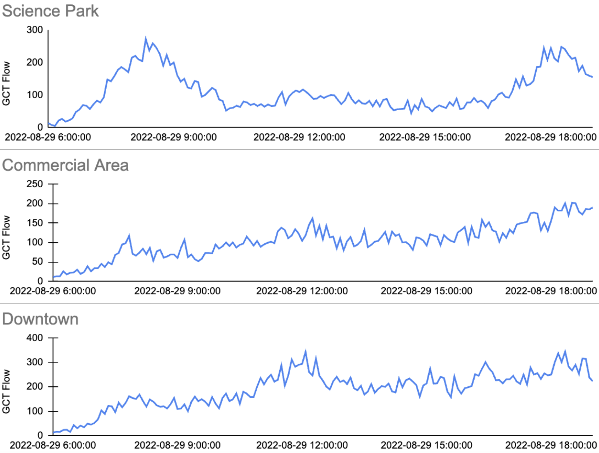
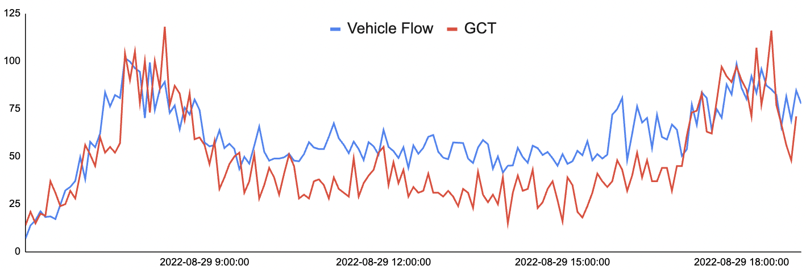
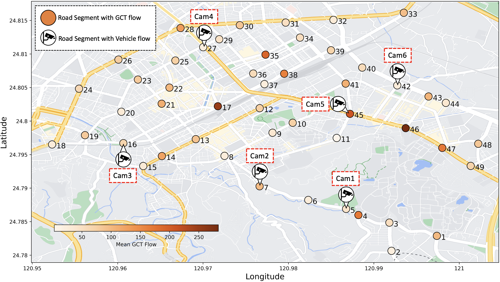

# CTCam (GCT Flow & Camera-based vehicle Flow) Dataset 

This is the original data repository of CTCam
This prototypical dataset cooperated with [Chunghwa Telecom laboratories](https://www.chttl.com.tw/en/index.html)

The dataset and experimental code materials are provided in the following.

## CTCam Demo Page
The CTCam demo is available at: https://cylin-gn.github.io/CTCam-demo

## Overview

### GCT

GCT is cellular traffic with estimated GPS coordinates obtained from triangulation, indicating where the traffic was generated. 

Here are the partial examples of GCT records (*IMEI numbers were hashed to protect privacy):

|       Time     |    IMEI        |    Longitude   |      Time      |    
|:--------------:|:--------------:|:--------------:|:--------------:| 
|       ...      |    ...         |    ...         |    ...         |  
|     07:30:36   |    H...aK      |   24.78711     |   120.98641    |
|     07:31:02   |    B...EQ      |   24.78702     |   120.98664    |
|     07:31:07   |    M...Gn      |   24.78703     |   120.98642    |
|       ...      |    ...         |    ...         |    ...         | 

### GCT Flow
We define GCT flow as the total quantity of GCT within a fixed interval (e.g., 5 minutes) using public traffic flow datasets.

Below are partial examples of GCT flows from areas near different regional functionality:



### Vehicle Flow
We deploy six cameras on a road segment with GCT flow to collect vehicle flow as a supplement for refining GCT flow. 
We define the total quantity of detected vehicles within a fixed interval (e.g., 5 minutes) as the vehicle flow.

Here is an example of the **GCT flow vs Vehicle Flow** for one road segment near Hsinchu Science Park:


### Road segment
The road segments are defined as 20m x 20m areas, which is based on the average road size in our proof-of-concept (POC) area in Hsinchu, Taiwan. 
All the GCTs listed in the above table are located within the predefined road segments, nearby various regional functionality.

Six road segments are selected for deploying camera for collecting vehicle flow.

Here are the distribution examples of selected road segments:



## Experimental Materials Providing 

### I. Graph Structure of Road Segments Network

We provide instructions on how to construct a road segment network in the Hsinchu POC area:

Graph structure construction: To generate the graph structure based on the **..._Distance.txt** file provided below, please follow the [script](https://github.com/liyaguang/DCRNN/blob/master/scripts/gen_adj_mx.py). 

#### GCT Flow
- [GPS coordinates for each road segment ID](./Data/Raw/GCT_Location.csv)
- [Distance between connected road segments (in meters)](./Data/Raw/GCT_Roads_Distance.txt)
- [road network structure file](./Data/hsin_49_GCT_0600_1900_rename/adj_mat_49_rename.pkl)


#### Vehicle Flow
- [GPS coordinates for each road segment ID](./Data/Raw/Vehicle_Flow_Location.csv)
- [Distance between connected road segments (in meters)](./Data/Raw/Vehicle_Flow_Roads_Distance.txt)
- [road network structure file](./Data/hsin_6_CCTV_0600_1900_rename/adj_mat_6_rename.pkl)

### II. CTCam dataset used for training

CTCam comprises GCT flow and vehicle flow. The Data Structure of CTCam is shown as follows:

|        Date         | Road Segment 1 | ...  | Road Segment 49 | Cam1 | ... | Cam6 | 
|:-------------------:|:--------------:|:--------------:|:--------------:|:--------------:|:--------------:|:--------------:|
|         ...         |    ...         |    ...         |    ...         |    ...        |    ...        |    ...        |
| 08-28 18:55 |  81        |  ...        |   228        |    151         |    ...        |   249        |
| 08-28 19:00 |  50        |  ...        |   186        |    138         |     ...        |   205        |
| 08-29 06:00 |  20        |  ...         |   31        |    38         |    ...        |   47        |
|         ...         |    ...         |    ...         |    ...         |      ...        |   ...        |

- The original CSV file for GCT flow is available at: [GCT flow.csv](./Data/Raw/GCT_Flow.csv)
- The original CSV file for Vehicle flow is available at: [Vehicle flow.csv](./Data/Raw/Vehicle_Flow_Raw.csv)
- To generate the **train/val/test datasets** for each type of GCT flow as {train,val,test}.npz, please follow the [script](https://github.com/liyaguang/DCRNN/blob/master/scripts/generate_training_data.py),
using the CSV files provided above.

The **processed train/val/test data structures file** are available, 
- data structures file for GCT flow: [Here](./Data/hsin_49_GCT_0600_1900_rename)
- data structures file for Vehiclw flow: [Here](./Data/hsin_6_CCTV_0600_1900_rename)

### III. Model Zoo

Download and store the trained models in 'pretrained' folder as follow:

```
./Model/save
```
This is the example that using [Graph Wavenet](https://github.com/nnzhan/Graph-WaveNet) as extractor and third-GCN-based model as shown in paper:
- Pretrained Extractor for GCT Flow: [exp202306161737_0.pth](./Model/save/exp202306161737_0.pth)
- Pretrained Extractor for Vehicle Flow: [exp202306161734_0.pth](./Model/save/exp202306161734_0.pth)
- Fusion & Third-GCN-based Training: [exp202306162115_0.pth](./Model/save/exp202306162115_0.pth)


